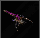
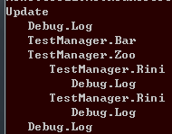
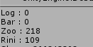

unifiler
====

<br>
유니티 퍼포먼스 프로파일러<br>

<br>
```cs
    public void Update()
    {
        Debug.Log("A");

        Bar(1, 2);

        Zoo();

        UnityEngine.Debug.Log("DEBUG");
    }
    public void Zoo()
    {
        Rini();
        Rini();
    }
    public void Rini()
    {
        Thread.Sleep(100);
        UnityEngine.Debug.Log("DEBUG");
    }
```

<br><br>

* 런타임에 오브젝트 온오프
* 오브젝트별 소요시간
* 느린 오브젝트 찾기
* 느린 프레임 찾기
